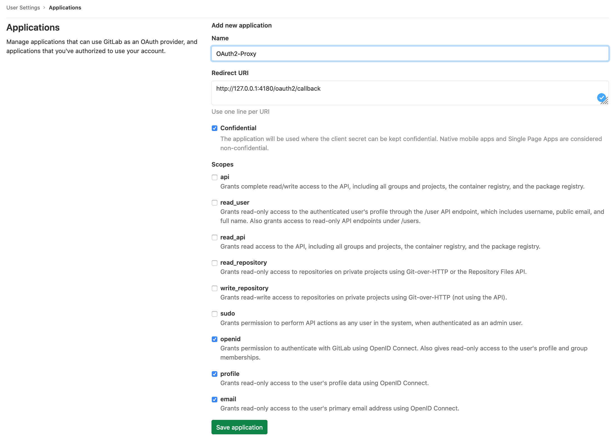
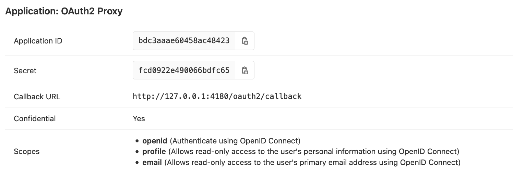

# Example how to connect OAuth2 Proxy to self hosted GitLab instance

How to connect [OAuth2 Proxy](https://oauth2-proxy.github.io/oauth2-proxy/) to self hosted GitLab instance.

Configure new [GitLab Application](https://docs.gitlab.com/ce/integration/oauth_provider.html):


<br />



Set variable env in [`docker-compose.yml`](docker-compose.yml)

```
$ docker-compose up -d
```

Go to http://127.0.0.1:4180/ signin and you must see `I'm xxxxxxx`

Some other urls:

- http://127.0.0.1:4180/ping
- http://127.0.0.1:4180/oauth2/sign_in
- http://127.0.0.1:4180/oauth2/sign_out
- http://127.0.0.1:4180/oauth2/userinfo

